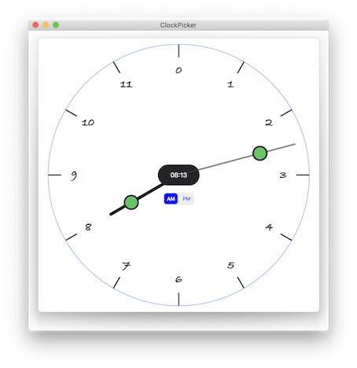

# SwiftUI Clock Time Picker

  

**ClockPicker** is a SwiftUI view that displays a clock with the hours and minutes hands.
These hands can be dragged around the clock face to select the desired hour and minutes of your date.

The main elements are **ClockPickerView.swift** and **ClockTime.swift**, see the demo in **ContenView.swift** for how to use it in your code.

The key to using this *ClockPickerView* in your code is to pass it your Date, such as:

    @State var date = Date()
    
    ClockPickerView(date: $date)

As the clock hands are changed, the date hours and minutes are updated.

That's it, very simple.

Can be used in SwiftUI ios and mac catalyst applications.

