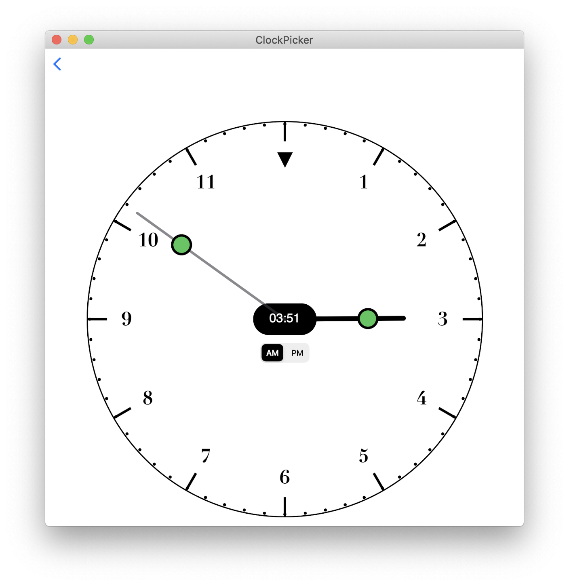
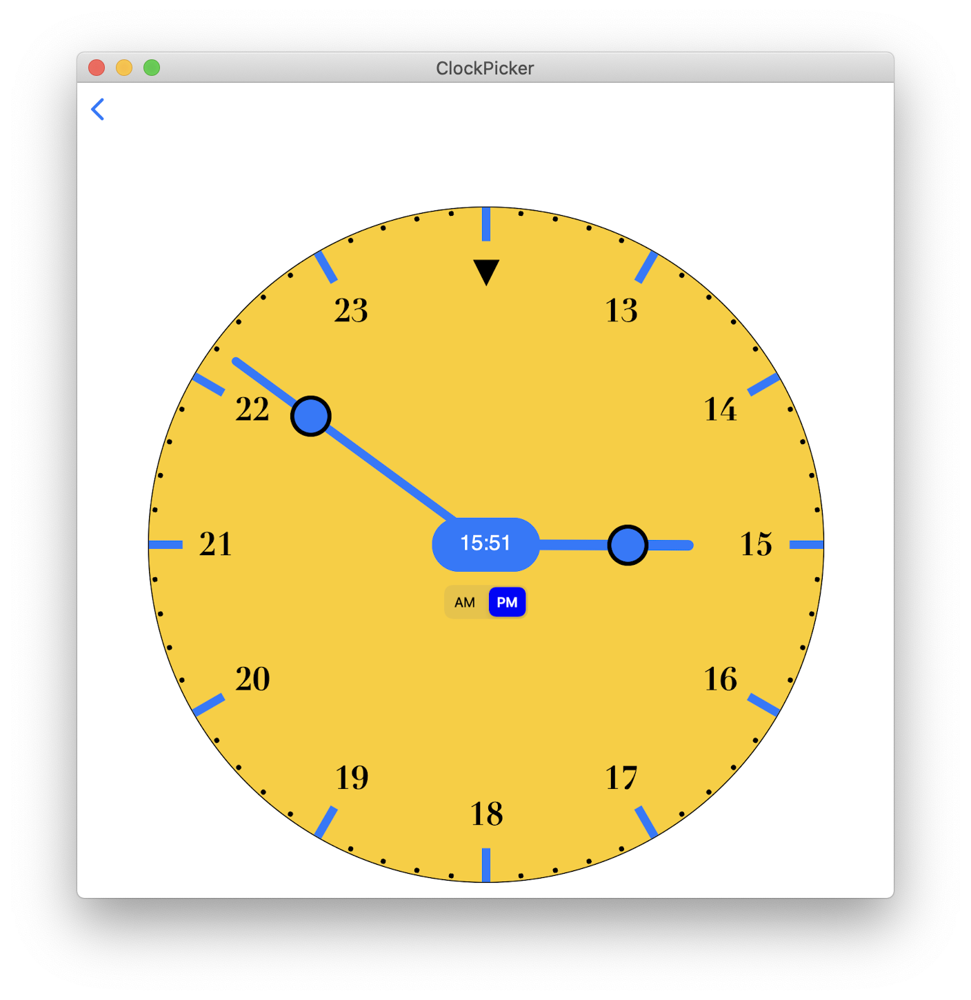

  

    
  

  

    
  

  

    
  

  

    
  

# SwiftUI Clock Time Picker

An exampe of using [**ClockTimePicker**](https://github.com/workingDog/ClockTimePicker) library.

## Clock with hands

[**ClockTimePicker**](https://github.com/workingDog/ClockTimePicker) is a SwiftUI view that displays a clock with the hour and minutes hands.
These hands can be dragged around the clock face to select the desired hour and minutes of your date.

See **ContenView.swift** for how to use it in your code.

The main element is **ClockPickerView.swift**.

Use it like a *DatePicker*, such as:

    @State var date = Date()
    
    ClockPickerView(date: $date)

As the clock hands are changed, the *date* hour and minutes are updated.

To customise the looks of the clock, use 

    @ObservedObject var options = ClockLooks()
    
and change the options as desired, see  *ContenView.swift*
    
## Clock without hands

**ClockTimePicker** can also display a clock without hands, more suited to iPad and Mac. To display it set the options as:

    options.withHands = false    

To pick the hour and minutes, tap on the center **hour : minute** to display either the hours or the minutes set.

Note: adjust the sizes and colors using **options** to suit your device, see  *ContenView.swift*

## Screenshots

   

     

