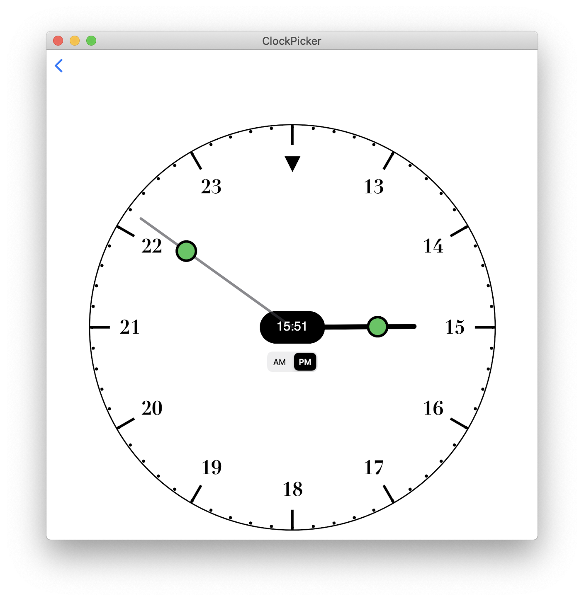

# SwiftUI Clock Time Picker

**ClockPicker** is a SwiftUI view that displays a clock with the hours and minutes hands.
These hands can be dragged around the clock face to select the desired hour and minutes of your date.

The main element is **ClockPickerView.swift**, see the demo in *ContenView.swift* for how to use it in your code.

Use it like a *DatePicker*, such as:

    @State var date = Date()
    
    ClockPickerView(date: $date)

As the clock hands are changed, the date hours and minutes are updated.

To customise the looks of the clock, use 

    @ObservedObject var options = ClockLooks()
    
and change the options as desired, see  *ContenView.swift*
    

That's it, very simple.

Can be used in SwiftUI ios and mac catalyst applications.

      
